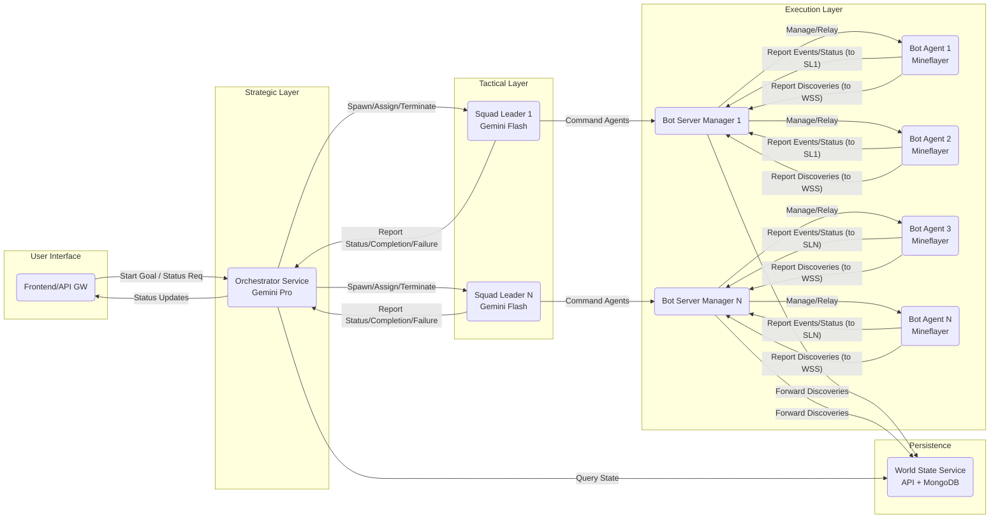

# Aetherius Project Plan

## 1. Introduction

This document outlines the development plan for the "Aetherius" project, a distributed, collaborative multi-agent system in Node.js designed to autonomously complete the "Beat the Ender Dragon" objective in Minecraft. The plan is based on the provided specification document.

## 2. Development Phases

The project will be developed in the following phases:

1.  **Phase 1: Project Setup & Core Infrastructure**
2.  **Phase 2: Bot Agent & BSM Development**
3.  **Phase 3: Squad Leader Development**
4.  **Phase 4: Orchestrator Development**
5.  **Phase 5: Integration, Testing & Refinement**

## 3. Detailed Plan

### Phase 1: Project Setup & Core Infrastructure

*   **Initialize Monorepo:** Set up the monorepo structure using pnpm workspaces (or Lerna/Nx). Create the basic directory structure outlined in Section 6 of the specification.
    *   `packages/orchestrator-service`
    *   `packages/squad-leader`
    *   `packages/bot-agent`
    *   `packages/world-state-service`
    *   `packages/bot-server-manager`
    *   `packages/frontend` (Optional)
    *   `packages/shared-types`
*   **Integrate Existing Code:** Determine the strategy for incorporating `pathfinder/`, `combat/`, and `mineflayer-custom/` into the monorepo structure (e.g., as packages, dependencies, or directly within `bot-agent`).
*   **Shared Types:** Define core data structures (TaskObject, AgentEvent, AgentStatusUpdate, etc.) in the `shared-types` package using TypeScript interfaces.
*   **World State Service:**
    *   Set up Express server.
    *   Define Mongoose schemas (pois, resource_nodes, infrastructure).
    *   Implement basic API endpoints (`/report`, `/query`).
    *   Set up MongoDB connection.
*   **Basic Communication:** Implement basic WebSocket connection logic using the `ws` library in components that need it (Orchestrator, Squad Leader, BSM, Frontend).

### Phase 2: Bot Agent & BSM Development

*   **Bot Server Manager (BSM):**
    *   Implement agent lifecycle management (spawn, monitor, terminate `bot-agent` processes).
    *   Set up WebSocket server for Orchestrator/Squad Leader connections.
    *   Implement local communication server (TCP/IPC) for Bot Agents.
    *   Implement message routing logic (WS -> Agent, Agent -> WS/World State).
*   **Bot Agent:**
    *   Set up basic Mineflayer bot connection using `mineflayer-custom`.
    *   Implement Control Unit (connect to BSM).
    *   Implement Reporting Module (send messages to BSM with correct destination).
    *   **Integrate Core Modules (Skeletons):**
        *   Load and interface with the `pathfinder` plugin for Navigation.
        *   Load and interface with the `combat` plugin for Combat.
        *   Implement skeleton logic for Perception, Inventory, Crafting, Mine, Explore based on Mineflayer API.
    *   Implement Task Execution Manager (TEM) skeleton.
    *   Implement Command Validation Layer.
    *   *(Note: Specific implementation details for how `attackTarget` and `guardTarget` utilize the combat/pathfinder plugins will be addressed during this implementation phase).*

### Phase 3: Squad Leader Development

*   **Squad Leader Process:** Set up the dynamic spawning mechanism (managed by Orchestrator).
*   **Communication:** Implement WebSocket clients to connect to Orchestrator and relevant BSMs.
*   **State Management:** Implement logic to track assigned agents, mission state, and build curated agent state summaries for the LLM.
*   **LLM Tactical Core:**
    *   Integrate Gemini 1.5 Flash SDK.
    *   Implement prompt construction logic.
    *   Define and handle LLM function calls (`agentCommandBatch`, `reportStatusToOrchestrator`, etc.).
*   **Command Dispatch:** Implement logic to send `squadLeader::agentCommand` to BSMs and reporting messages to Orchestrator.
*   **Termination Handling:** Implement graceful shutdown on `squadLeader::terminate`.

### Phase 4: Orchestrator Development

*   **Communication:**
    *   Implement WebSocket clients to connect to BSMs and Squad Leaders.
    *   Implement WebSocket server (optional, for Frontend).
    *   Implement HTTP client for World State Service queries.
*   **State Management:** Implement tracking for BSMs, agents, and active Squad Leaders. Store the LLM's Plan Representation.
*   **LLM Planner:**
    *   Integrate Gemini 1.5 Pro SDK.
    *   Implement strategic prompt construction logic (including Plan Representation, World State Summary, etc.).
    *   Define and handle LLM function calls (`delegateTaskToSquad`, `requestWorldStateQuery`, `setPlanRepresentation`).
*   **Squad Management Module:**
    *   Implement agent selection logic based on `delegateTaskToSquad` calls.
    *   Implement Squad Leader spawning and lifecycle management (sending `init`, handling `complete`/`failed`, termination).
*   **Monitoring & Adaptation:** Implement logic to handle incoming Squad Leader reports, identify Significant Events, and trigger LLM Planner re-evaluation.

### Phase 5: Integration, Testing & Refinement

*   **End-to-End Testing:** Test key workflows (Squad Task Assignment, Global State Update).
*   **Bot Agent Module Implementation:** Flesh out the skeleton logic in the Bot Agent's Core Modules (Perception, Mine, Crafting, etc.).
*   **LLM Prompt Engineering:** Refine prompts for both Orchestrator (Pro) and Squad Leader (Flash) for optimal performance and reliability.
*   **Error Handling & Resilience:** Implement robust error handling and recovery mechanisms across all services.
*   **Deployment:** Configure `docker-compose.yml` for local deployment and testing.

## 4. Diagrams

### Component Interaction Overview



### Squad Task Workflow

```mermaid
sequenceDiagram
    participant O as Orchestrator (LLM Pro)
    participant SL as Squad Leader (LLM Flash)
    participant BSM as Bot Server Manager
    participant Agent as Bot Agent
    participant WSS as World State Service

    O->>O: LLM decides: delegateTaskToSquad(...)
    O->>SL: Spawn Process & Send squadLeader::init
    SL->>O: Connect WS
    SL->>BSM: Connect WS (for each agent's BSM)
    SL->>SL: LLM decides: agentCommandBatch(...)
    SL->>BSM: squadLeader::agentCommand
    BSM->>Agent: Forward Command (Local IPC/TCP)
    Agent->>Agent: Validate & Execute Task (using Mineflayer, Pathfinder, Combat)
    opt Perception Discovery
        Agent->>BSM: foundPOI/foundResource (dest: world_state_service)
        BSM->>WSS: Forward Report (HTTP POST)
        WSS->>WSS: Store in MongoDB
    end
    Agent->>BSM: agent::event::* / agent::statusUpdate (dest: squadLeaderId)
    BSM->>SL: Forward Event/Status (WS)
    SL->>SL: Update State, Trigger LLM Tactical Core
    SL->>O: squadLeader::statusUpdate (WS)
    loop Task Execution
        SL->>SL: LLM decides: agentCommandBatch(...)
        SL->>BSM: squadLeader::agentCommand
        BSM->>Agent: Forward Command
        Agent->>Agent: Execute...
        Agent->>BSM: agent::event::* / statusUpdate
        BSM->>SL: Forward Event/Status
        SL->>SL: Update State...
    end
    SL->>SL: LLM decides: declareMissionComplete / declareMissionFailed
    SL->>O: squadLeader::missionComplete / missionFailed (WS)
    O->>O: Update Agent Status (Idle)
    O->>SL: squadLeader::terminate (WS)
    SL->>SL: Cleanup & process.exit()