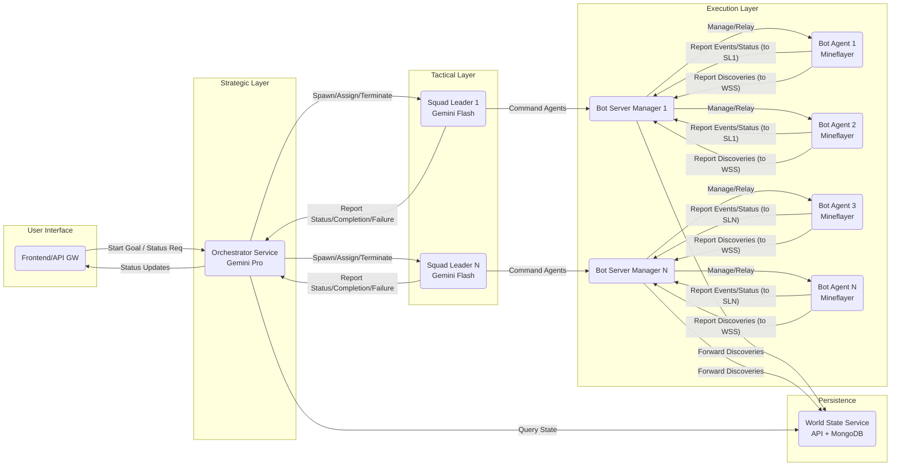

# Aetherius Project Plan

## 1. Introduction

This document outlines the development plan for the "Aetherius" project, a distributed, collaborative multi-agent system in Node.js designed to autonomously complete the "Beat the Ender Dragon" objective in Minecraft. The plan is based on the provided specification document.

## 2. Development Phases

The project will be developed in the following phases:

1.  **Phase 1: Project Setup & Core Infrastructure**
2.  **Phase 2: Bot Agent & BSM Development**
3.  **Phase 3: Squad Leader Development**
4.  **Phase 4: Orchestrator Development**
5.  **Phase 5: Integration, Testing & Refinement**

## 3. Detailed Plan

### Phase 1: Project Setup & Core Infrastructure

*   **Initialize Monorepo:** Set up the monorepo structure using pnpm workspaces (or Lerna/Nx). Create the basic directory structure outlined in Section 6 of the specification.
    *   `packages/orchestrator-service`
    *   `packages/squad-leader`
    *   `packages/bot-agent`
    *   `packages/world-state-service`
    *   `packages/bot-server-manager`
    *   `packages/frontend` (Optional)
    *   `packages/shared-types`
*   **Integrate Existing Code:** Determine the strategy for incorporating `pathfinder/`, `combat/`, and `mineflayer-custom/` into the monorepo structure (e.g., as packages, dependencies, or directly within `bot-agent`).
*   **Shared Types:** Define core data structures (TaskObject, AgentEvent, AgentStatusUpdate, etc.) in the `shared-types` package using TypeScript interfaces.
*   **World State Service:**
    *   Set up Express server.
    *   Define Mongoose schemas (pois, resource_nodes, infrastructure).
    *   Implement basic API endpoints (`/report`, `/query`).
    *   Set up MongoDB connection.
*   **Basic Communication:** Implement basic WebSocket connection logic using the `ws` library in components that need it (Orchestrator, Squad Leader, BSM, Frontend).

### Phase 2: Bot Agent & BSM Development

*   **Bot Server Manager (BSM):**
    *   Implement agent lifecycle management (spawn, monitor, terminate `bot-agent` processes).
    *   Set up WebSocket server for Orchestrator/Squad Leader connections.
    *   Implement local communication server (TCP/IPC) for Bot Agents.
    *   Implement message routing logic (WS -> Agent, Agent -> WS/World State).
*   **Bot Agent:**
    *   Set up basic Mineflayer bot connection using `mineflayer-custom`.
    *   Implement Control Unit (connect to BSM).
    *   Implement Reporting Module (send messages to BSM with correct destination).
    *   **Integrate Core Modules (Skeletons):**
        *   Load and interface with the `pathfinder` plugin for Navigation.
        *   Load and interface with the `combat` plugin for Combat.
        *   Implement skeleton logic for Perception, Inventory, Crafting, Mine, Explore based on Mineflayer API.
    *   Implement Task Execution Manager (TEM) skeleton.
    *   Implement Command Validation Layer.
    *   *(Note: Specific implementation details for how `attackTarget` and `guardTarget` utilize the combat/pathfinder plugins will be addressed during this implementation phase).*

### Phase 3: Squad Leader Development

*   **Squad Leader Process:** Set up the dynamic spawning mechanism (managed by Orchestrator).
*   **Communication:** Implement WebSocket clients to connect to Orchestrator and relevant BSMs.
*   **State Management:** Implement logic to track assigned agents, mission state, and build curated agent state summaries for the LLM.
*   **LLM Tactical Core:**
    *   Integrate Gemini 1.5 Flash SDK.
    *   Implement prompt construction logic.
    *   Define and handle LLM function calls (`agentCommandBatch`, `reportStatusToOrchestrator`, etc.).
*   **Command Dispatch:** Implement logic to send `squadLeader::agentCommand` to BSMs and reporting messages to Orchestrator.
*   **Termination Handling:** Implement graceful shutdown on `squadLeader::terminate`.

### Phase 4: Orchestrator Development

*   **Communication:**
    *   Implement WebSocket clients to connect to BSMs and Squad Leaders.
    *   Implement WebSocket server (optional, for Frontend).
    *   Implement HTTP client for World State Service queries.
*   **State Management:** Implement tracking for BSMs, agents, and active Squad Leaders. Store the LLM's Plan Representation.
*   **LLM Planner:**
    *   Integrate Gemini 1.5 Pro SDK.
    *   Implement strategic prompt construction logic (including Plan Representation, World State Summary, etc.).
    *   Define and handle LLM function calls (`delegateTaskToSquad`, `requestWorldStateQuery`, `setPlanRepresentation`).
*   **Squad Management Module:**
    *   Implement agent selection logic based on `delegateTaskToSquad` calls.
    *   Implement Squad Leader spawning and lifecycle management (sending `init`, handling `complete`/`failed`, termination).
*   **Monitoring & Adaptation:** Implement logic to handle incoming Squad Leader reports, identify Significant Events, and trigger LLM Planner re-evaluation.

### Phase 5: Integration, Testing & Refinement

*   **End-to-End Testing:** Test key workflows (Squad Task Assignment, Global State Update).
*   **Bot Agent Module Implementation:** Flesh out the skeleton logic in the Bot Agent's Core Modules (Perception, Mine, Crafting, etc.).
*   **LLM Prompt Engineering:** Refine prompts for both Orchestrator (Pro) and Squad Leader (Flash) for optimal performance and reliability.
*   **Error Handling & Resilience:** Implement robust error handling and recovery mechanisms across all services.
*   **Deployment:** Configure `docker-compose.yml` for local deployment and testing.

## 4. Diagrams

### Component Interaction Overview



### Squad Task Workflow

```mermaid
sequenceDiagram
    participant O as Orchestrator (LLM Pro)
    participant SL as Squad Leader (LLM Flash)
    participant BSM as Bot Server Manager
    participant Agent as Bot Agent
    participant WSS as World State Service

    O->>O: LLM decides: delegateTaskToSquad(...)
    O->>SL: Spawn Process & Send squadLeader::init
    SL->>O: Connect WS
    SL->>BSM: Connect WS (for each agent's BSM)
    SL->>SL: LLM decides: agentCommandBatch(...)
    SL->>BSM: squadLeader::agentCommand
    BSM->>Agent: Forward Command (Local IPC/TCP)
    Agent->>Agent: Validate & Execute Task (using Mineflayer, Pathfinder, Combat)
    opt Perception Discovery
        Agent->>BSM: foundPOI/foundResource (dest: world_state_service)
        BSM->>WSS: Forward Report (HTTP POST)
        WSS->>WSS: Store in MongoDB
    end
    Agent->>BSM: agent::event::* / agent::statusUpdate (dest: squadLeaderId)
    BSM->>SL: Forward Event/Status (WS)
    SL->>SL: Update State, Trigger LLM Tactical Core
    SL->>O: squadLeader::statusUpdate (WS)
    loop Task Execution
        SL->>SL: LLM decides: agentCommandBatch(...)
        SL->>BSM: squadLeader::agentCommand
        BSM->>Agent: Forward Command
        Agent->>Agent: Execute...
        Agent->>BSM: agent::event::* / statusUpdate
        BSM->>SL: Forward Event/Status
        SL->>SL: Update State...
    end
    SL->>SL: LLM decides: declareMissionComplete / declareMissionFailed
    SL->>O: squadLeader::missionComplete / missionFailed (WS)
    O->>O: Update Agent Status (Idle)
    O->>SL: squadLeader::terminate (WS)
    SL->>SL: Cleanup & process.exit()
## 5. Progress Report (as of 2025-04-19 12:57 PM PST)

This section summarizes the development progress based on the initial plan.

### Phase 1: Project Setup & Core Infrastructure

*   **[COMPLETED]** Initialize Monorepo: pnpm workspace setup, basic directory structure created.
*   **[COMPLETED]** Integrate Existing Code: Pathfinder and Combat packages integrated as workspace dependencies. Mineflayer-core created as a local package.
*   **[COMPLETED]** Shared Types: Core data structures (TaskObject, AgentEvent, AgentStatusSnapshot, etc.) defined in `@aetherius/shared-types`.
*   **[COMPLETED]** World State Service:
    *   Basic Express server setup.
    *   Mongoose schemas defined (pois, resource\_nodes, infrastructure).
    *   Basic API endpoints (`/report`, `/query`) implemented with placeholder logic (including basic deduplication in `/report`).
    *   MongoDB connection setup.
*   **[COMPLETED]** Basic Communication: Basic WebSocket server/client logic implemented in Orchestrator, Squad Leader, BSM using `ws`. Basic HTTP client logic in Orchestrator for World State queries.

### Phase 2: Bot Agent & BSM Development

*   **[COMPLETED]** Bot Server Manager (BSM):
    *   Basic agent lifecycle management (spawn, monitor using placeholders).
    *   WebSocket server setup.
    *   Local communication server setup (TCP).
    *   Basic message routing logic implemented (WS -> Agent, Agent -> WS/World State).
*   **[COMPLETED]** Bot Agent:
    *   Basic Mineflayer bot connection setup using `@aetherius/mineflayer-core`.
    *   Control Unit implemented (connects to BSM via TCP).
    *   Reporting Module implemented (sends messages to BSM).
    *   **Core Modules Integration:**
        *   NavigationModule: Implemented `navigateTo` using `@aetherius/pathfinder`.
        *   CombatModule: Implemented `attack` and `guard` using `@aetherius/combat` (assumes `swordpvp`/`bowpvp` API).
        *   PerceptionModule: Implemented basic environment scanning for strategic resources/POIs.
        *   InventoryModule: Implemented `equip`, `toss`, `findItem`, `itemCount` wrappers around Mineflayer API.
        *   CraftingModule: Implemented `craftItem` using Mineflayer API.
        *   MineModule: Implemented basic `gather` logic (find, navigate, dig).
        *   ExploreModule: Skeleton created.
    *   Task Execution Manager (TEM): Skeleton implemented with delegation logic for implemented modules.
    *   Command Validation Layer: Basic placeholder function created.

### Phase 3: Squad Leader Development

*   **[COMPLETED]** Squad Leader Process: Setup for dynamic spawning via Orchestrator complete.
*   **[COMPLETED]** Communication: WebSocket clients implemented to connect to Orchestrator and BSMs.
*   **[COMPLETED]** State Management: Basic logic to track assigned agents and mission state implemented. Agent status summary structure defined.
*   **[COMPLETED]** LLM Tactical Core:
    *   Gemini 1.5 Flash SDK integrated.
    *   Basic prompt construction logic implemented in `runTacticalPlanning`.
    *   Tool schemas defined (`agentCommandBatch`, `reportStatusToOrchestrator`, etc.).
    *   Basic handling of LLM function calls implemented.
*   **[COMPLETED]** Command Dispatch: Logic to send commands to BSMs and reports to Orchestrator implemented.
*   **[COMPLETED]** Termination Handling: Basic graceful shutdown implemented.

### Phase 4: Orchestrator Development

*   **[COMPLETED]** Communication:
    *   WebSocket clients (placeholder for BSM/Squad Leader connections).
    *   WebSocket server implemented (for BSMs, Squad Leaders, Frontend).
    *   HTTP client implemented for World State Service queries.
*   **[COMPLETED]** State Management: Basic tracking for BSMs, agents, active Squads implemented. Placeholder for Plan Representation.
*   **[COMPLETED]** LLM Planner:
    *   Gemini 1.5 Pro SDK integrated.
    *   Basic strategic prompt construction logic implemented in `runStrategicPlanning`.
    *   Tool schemas defined (`delegateTaskToSquad`, `requestWorldStateQuery`, `setPlanRepresentation`).
    *   Basic handling of LLM function calls implemented (including executing world state queries).
*   **[COMPLETED]** Squad Management Module:
    *   Basic agent selection logic (random/proximity placeholder).
    *   Squad Leader spawning (`fork`) and lifecycle management implemented.
*   **[COMPLETED]** Monitoring & Adaptation: Basic handling of Squad Leader reports implemented, triggering `runStrategicPlanning` on significant events.

### Remaining Tasks / Next Steps

*   **Phase 2 Refinement (Bot Agent & BSM):**
    *   **BSM:** Implement robust agent monitoring and restart logic. Refine BSM registration with Orchestrator (e.g., sending initial agent list). Implement secure authentication for WS connections.
    *   **Bot Agent:**
        *   Flesh out `MineModule`: Implement vein/clump identification, handle tool durability, better collection logic.
        *   Flesh out `CraftingModule`: Handle placing/reclaiming crafting tables, manage inventory during crafting.
        *   Flesh out `ExploreModule`: Implement actual exploration strategies (random walk, systematic scan).
        *   Implement `Command Validation Layer` with actual checks (inventory, reachability).
        *   Implement `Recipe/Dependency Module` for prerequisite checks in TEM.
        *   Refine `CombatModule`: Integrate specific combat plugin API calls accurately, handle different weapons (bow), implement target selection/prioritization within `guard`.
        *   Refine `NavigationModule`: Implement `navigateToGoalFollowEntity`, `navigateToGoalBlock`. Handle pathfinding errors more robustly (e.g., retries, reporting obstacles).
        *   Implement error handling and recovery within modules (e.g., what happens if digging fails?).
*   **Phase 3 Refinement (Squad Leader):**
    *   **LLM Tactical Core:** Refine prompt engineering, implement sophisticated context building (curating agent summaries, event history), handle complex sequences of function calls, manage conversation history effectively.
    *   **State Management:** Implement detailed mission progress tracking.
    *   **Error Handling:** Improve handling of BSM/Agent disconnections and command failures.
*   **Phase 4 Refinement (Orchestrator):**
    *   **LLM Planner:** Refine strategic prompt engineering, implement dynamic World State summary fetching, manage conversation history, handle complex planning scenarios and re-planning logic. Implement robust handling of `requestWorldStateQuery` results (feeding back into subsequent planning).
    *   **Squad Management:** Implement sophisticated agent selection criteria (proximity based on actual agent location updates, inventory state, tags). Store and utilize `taskDetails` when sending `squadLeader::init`.
    *   **Monitoring & Adaptation:** Implement more nuanced detection of Significant Events (e.g., multiple failures, resource depletion patterns).
    *   **Plan Representation:** Define and implement the storage and usage of the structured plan representation generated by the LLM.
*   **Phase 5: Integration, Testing & Refinement:**
    *   Implement comprehensive end-to-end tests for key workflows.
    *   Conduct extensive testing in a Minecraft environment.
    *   Refine all modules based on testing feedback.
    *   Optimize LLM prompts and interactions.
    *   Finalize deployment configuration (`docker-compose.yml`).
    *   (Optional) Develop the Frontend UI further.
## 6. Squad Leader Refinement Plan (Phase 3 Continued)

This section details the plan for refining the Squad Leader component, focusing on enhancing its LLM interaction, state management, and error handling capabilities.

**Goal 1: Enhance LLM Tactical Core (`runTacticalPlanning` & related functions)**

*   **1.1 Implement Conversation History:**
    *   Modify `runTacticalPlanning` to maintain a persistent `history` array (tracking user/model turns) for each planning session, likely using `tacticalModel.startChat()`.
    *   Pass the relevant history into subsequent `sendMessage` calls instead of using `generateContent` for single-shot requests.
    *   Update the history array after each successful LLM interaction.
    *   Adjust prompt structures (system instruction, user messages) to fit a conversational format.
*   **1.2 Refine Context Building:**
    *   Modify the `assignedAgents` state structure to store the complete, latest `AgentStatusSnapshot` received for each agent, replacing the current partial summary.
    *   Update the `updateAgentStatusSummary` function (perhaps rename it to `updateAgentSnapshot`) to store this full snapshot.
    *   Enhance the prompt generation logic within `runTacticalPlanning`:
        *   Create a more sophisticated summary of agent states derived from the full snapshots (e.g., highlighting changes since the last turn, key inventory items, current task status).
        *   Implement a more robust event history mechanism (e.g., storing recent significant `AgentEvent` objects) and include a summary in the prompt.
*   **1.3 Improve Prompt Engineering:**
    *   Review and significantly refine the `systemInstruction` to provide clearer tactical guidance, constraints, and expected behavior within a multi-turn conversation.
    *   Restructure the user prompts within the conversation (Task 1.1) for better readability and focus (e.g., using Markdown sections for Mission, Agent Status, Recent Events, Instructions).
*   **1.4 Handle Complex Function Call Sequences:** (Dependent on Task 1.1)
    *   Test and ensure the conversational approach (Task 1.1) correctly handles scenarios where the LLM needs to make multiple function calls sequentially to achieve a tactical goal.
    *   Verify that the state updates correctly between LLM calls in a sequence.

**Goal 2: Improve State Management**

*   **2.1 Detailed Mission Progress Tracking:**
    *   Define a more structured approach to track mission progress within the Squad Leader's state, potentially linked to the `taskDetails` received during initialization. This could involve:
        *   Identifying sub-tasks or stages.
        *   Tracking the completion status of these stages based on `agent::event::taskComplete` or specific LLM reports.
    *   Store the final `results` payload from `declareMissionComplete` for potential later use or reporting.
*   **2.2 Store Full Agent Snapshots:** (Covered by Task 1.2)

**Goal 3: Enhance Error Handling & Resilience**

*   **3.1 BSM/Agent Disconnection Handling:**
    *   Implement robust reconnection logic (e.g., exponential backoff) in the BSM WebSocket `close` and `error` handlers.
    *   If reconnection fails permanently, update the agent's status in `assignedAgents` to 'disconnected' or 'lost'.
    *   Send a new message type (e.g., `squadLeader::agentLost`) to the Orchestrator.
    *   Trigger `runTacticalPlanning` to inform the LLM about the lost agent so it can adapt the plan.
*   **3.2 Command Failure Handling:**
    *   Ensure `agent::event::taskFailed` events are explicitly captured and included in the context for the next LLM planning cycle (part of Task 1.2).
    *   Modify `sendCommandBatch`: If a command cannot be sent (e.g., BSM socket closed), handle this failure more actively. Report it internally, and if persistent, feed it back to the LLM via `runTacticalPlanning`.
*   **3.3 LLM Interaction Error Handling:**
    *   Improve the `catch` block in `runTacticalPlanning`.
    *   Report specific LLM API errors (e.g., API key issues, rate limits, content filtering) or persistent timeouts to the Orchestrator via a status update or a dedicated error message (e.g., `squadLeader::llmError`).
    *   Consider strategies like retrying LLM calls or declaring mission failure if the LLM core is consistently unresponsive.

**Visualization of Task Dependencies:**

```mermaid
graph TD
    subgraph Goal 1: LLM Core
        G1_T1(1.1 Implement Conversation History) --> G1_T2(1.2 Refine Context Building);
        G1_T1 --> G1_T3(1.3 Improve Prompt Engineering);
        G1_T2 --> G1_T3;
        G1_T1 --> G1_T4(1.4 Handle Complex Function Calls - Testing);
    end

    subgraph Goal 2: State Management
        G2_T1(2.1 Detailed Mission Progress Tracking);
        G1_T2 -- Provides data for --> G2_T1;
    end

    subgraph Goal 3: Error Handling
        G3_T1(3.1 BSM/Agent Disconnect Handling);
        G3_T2(3.2 Command Failure Handling);
        G3_T3(3.3 LLM Interaction Error Handling);
        G1_T1 -- Impacts --> G3_T3;
        G1_T2 -- Provides context for --> G3_T1;
        G1_T2 -- Provides context for --> G3_T2;
    end

    %% Dependencies
    G1_T1 -- Foundational for --> G1_T2;
    G1_T1 -- Foundational for --> G1_T3;
    G1_T1 -- Foundational for --> G1_T4;
    G1_T2 -- Foundational for --> G2_T1;
    G1_T2 -- Foundational for --> G3_T1;
    G1_T2 -- Foundational for --> G3_T2;


    style G1_T1 fill:#ccf,stroke:#333,stroke-width:2px
    style G1_T2 fill:#ccf,stroke:#333,stroke-width:2px
    style G1_T3 fill:#ccf,stroke:#333,stroke-width:2px
    style G1_T4 fill:#ccf,stroke:#333,stroke-width:2px
    style G2_T1 fill:#cfc,stroke:#333,stroke-width:2px
    style G3_T1 fill:#fcc,stroke:#333,stroke-width:2px
    style G3_T2 fill:#fcc,stroke:#333,stroke-width:2px
    style G3_T3 fill:#fcc,stroke:#333,stroke-width:2px
## 7. Orchestrator Refinement Plan (Phase 4 Continued)

This section details the plan for refining the Orchestrator component, focusing on enhancing its strategic planning capabilities, squad management, monitoring, and use of a structured plan representation.

**Goal 1: Enhance LLM Planner (`runStrategicPlanning` & related functions)**

*   **1.1 Improve Conversation History Management:**
    *   Implement history pruning (e.g., keep last N turns, potentially summarize older turns) within `runStrategicPlanning` to manage the context window size for Gemini Pro, modifying how `currentHistory` is constructed or passed to the model.
*   **1.2 Implement Dynamic World State Summary:**
    *   Modify `runStrategicPlanning` to call `queryWorldState` *before* constructing the main prompt.
    *   Define relevant queries (e.g., `query({ dataType: 'resourceNode', coords: { $near: {...} } })`, `query({ dataType: 'poi', status: 'unexplored' })`) to fetch a concise summary of the world state relevant to the current plan/goal.
    *   Replace the placeholder `worldStateSummary` with the dynamically fetched data in the user prompt.
*   **1.3 Enhance World State Query Handling:**
    *   Refactor the LLM interaction loop within `runStrategicPlanning` to properly handle the `requestWorldStateQuery` tool call:
        *   When the LLM calls `requestWorldStateQuery`, execute the query via `queryWorldState`.
        *   Construct a *new* user message containing the query results (or a summary if large).
        *   Send this result message back to the LLM *within the same planning run* using the chat session (`tacticalChatSession.sendMessage(...)`) to allow the LLM to use the information for subsequent decisions in that run.
*   **1.4 Refine Strategic Prompt Engineering:**
    *   Update the `systemInstruction` to explicitly guide the LLM on using the dynamic world state summary, managing the plan representation (Goal 4), and adapting the plan based on events (Goal 3).
    *   Refine the user prompt structure (using Markdown) to clearly present the dynamic world state summary, agent status, active squads, current plan representation, and the triggering event.
*   **1.5 Improve Re-planning Logic:**
    *   Enhance the prompt instructions (System & User) to guide the LLM on *how* to adapt the plan based on different triggering events (e.g., "Mission failed due to [reason], update plan representation and delegate alternative task", "Strategic find [details] reported, update plan and consider delegating investigation").

**Goal 2: Enhance Squad Management (`selectAgents`, `createAndAssignSquad`)**

*   **2.1 Implement Advanced Agent Selection:**
    *   Modify the `AgentInfo` type in `packages/shared-types/src/index.ts` to optionally include `tags?: string[]` and `keyInventorySummary?: { [itemName: string]: number }`.
    *   *(Dependency: BSM/Agent)* Update BSM registration/Agent status updates to report tags and key inventory.
    *   Modify the `selectAgents` function in the Orchestrator:
        *   Add logic to parse `selectionCriteria` for `requiredTags` or `requiredInventory`.
        *   Filter the `idleAgents` list based on these new criteria *before* applying proximity or random selection.
*   **2.2 Refine Task Details Usage:**
    *   Review the structure of `taskDetails` expected by the Squad Leader (`handleInitialization`) and ensure the Orchestrator LLM (`delegateTaskToSquad` tool description and prompt guidance) provides details in the correct format.

**Goal 3: Enhance Monitoring & Adaptation**

*   **3.1 Implement Nuanced Significant Event Detection:**
    *   Introduce state variables in the Orchestrator to track recent squad failures or specific event patterns (e.g., `squadFailureCounts: Map<squadId, number>`).
    *   In the WebSocket message handler, update these tracking variables when relevant events occur (`squadLeader::missionFailed`).
    *   Add logic to check these tracking variables periodically or after specific events. If a pattern is detected (e.g., 3 failures for the same squad), trigger `runStrategicPlanning` with a new, specific event type (e.g., `{ type: 'repeatedSquadFailure', squadId }`).

**Goal 4: Implement Plan Representation Usage**

*   **4.1 Define Plan Structure:**
    *   Define a clear TypeScript interface within the Orchestrator (or potentially in `shared-types` if needed elsewhere) for the `currentPlanRepresentation` state variable. Example structure:
        ```typescript
        interface PlanPhase {
          id: string;
          description: string;
          status: 'pending' | 'in_progress' | 'complete' | 'failed';
          objectives: PlanObjective[];
        }
        interface PlanObjective {
          id: string;
          description: string;
          status: 'pending' | 'in_progress' | 'complete' | 'failed';
          dependsOn?: string[]; // IDs of objectives/phases
          assignedSquad?: string;
        }
        type PlanRepresentation = PlanPhase[];
        ```
    *   Initialize `currentPlanRepresentation` potentially as an empty array or null.
*   **4.2 Integrate Plan into LLM Context:**
    *   Modify `runStrategicPlanning` to include the *structured* `currentPlanRepresentation` (formatted clearly, perhaps as Markdown or summarized JSON) in the user prompt.
    *   Update prompt instructions (System & User) to guide the LLM to reference this plan structure when making decisions and to update it via the `setPlanRepresentation` tool.
*   **4.3 Implement Plan Update Logic:**
    *   In the `setPlanRepresentation` tool handler, parse the incoming `plan` argument from the LLM.
    *   Validate the received plan against the defined interface structure.
    *   Update the `currentPlanRepresentation` state variable with the validated plan.

**Visualization of Task Dependencies:**

```mermaid
graph TD
    subgraph Goal 1: LLM Planner
        G1_T1(1.1 History Mgmt)
        G1_T2(1.2 Dynamic World State Summary) --> G1_T4;
        G1_T3(1.3 Query Result Handling) --> G1_T4;
        G1_T4(1.4 Prompt Engineering);
        G1_T5(1.5 Re-planning Logic) -- Uses --> G1_T4;
        G1_T1 --> G1_T4;
    end

    subgraph Goal 2: Squad Management
        G2_T1(2.1 Advanced Agent Selection);
        G2_T2(2.2 Task Details Refinement);
    end

    subgraph Goal 3: Monitoring & Adaptation
        G3_T1(3.1 Nuanced Event Detection);
        G3_T1 -- Triggers --> G1_T5;
    end

    subgraph Goal 4: Plan Representation
        G4_T1(4.1 Define Plan Structure);
        G4_T2(4.2 Integrate Plan into Context) -- Uses --> G4_T1;
        G4_T3(4.3 Implement Plan Update) -- Uses --> G4_T1;
        G4_T2 --> G1_T4; % Plan context affects prompt
        G4_T3 -- Triggered by LLM --> G4_T3; % LLM calls setPlanRepresentation
    end

    %% Dependencies
    G1_T2 -- Requires --> WorldStateService;
    G1_T3 -- Requires --> WorldStateService;
    G2_T1 -- Requires changes in --> SharedTypes;
    G2_T1 -- Requires changes in --> BSM; % Potentially for reporting tags/inventory
    G2_T2 -- Requires review of --> SquadLeader;
    G3_T1 -- Uses data from --> SquadLeader; % Failure messages

    style G1_T1 fill:#ccf,stroke:#333,stroke-width:2px
    style G1_T2 fill:#ccf,stroke:#333,stroke-width:2px
    style G1_T3 fill:#ccf,stroke:#333,stroke-width:2px
    style G1_T4 fill:#ccf,stroke:#333,stroke-width:2px
    style G1_T5 fill:#ccf,stroke:#333,stroke-width:2px
    style G2_T1 fill:#cfc,stroke:#333,stroke-width:2px
    style G2_T2 fill:#cfc,stroke:#333,stroke-width:2px
    style G3_T1 fill:#fcc,stroke:#333,stroke-width:2px
    style G4_T1 fill:#ffc,stroke:#333,stroke-width:2px
    style G4_T2 fill:#ffc,stroke:#333,stroke-width:2px
    style G4_T3 fill:#ffc,stroke:#333,stroke-width:2px